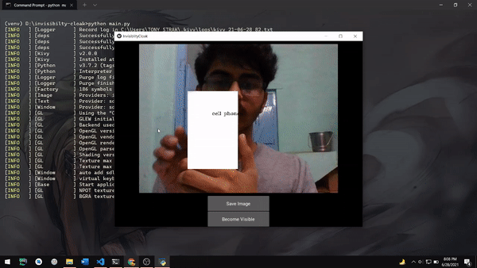

# Invisibility Cloak - (...sort of)

...well it turns out object removal is kinda hard. So I just used Object Detection using this [tutorial](https://www.youtube.com/watch?v=HXDD7-EnGBY&ab_channel=Murtaza%27sWorkshop-RoboticsandAI)
and made the detected object a White Rectangle.

I used the following tutorials:

- [For Object Detection](https://www.youtube.com/watch?v=HXDD7-EnGBY&ab_channel=Murtaza%27sWorkshop-RoboticsandAI)
- [For using OpenCV in Kivy](https://www.youtube.com/watch?v=PwUWtfk2inQ&ab_channel=CoderMonk)

## Demo

_Turn Detected Objects into White Rectangles in real-time with a click of a Button_

_...Also Save Images with White Rectangles in real-time with a click of a Button_



## Installation

#### Clone the Repository

```bash
git clone https://github.com/ish-u/Invisibility-Cloak-init-day-1.git
cd Invisibility-Cloak-init-day-1
```

#### Create Virtual Environment and Install Packages

```bash
python -m  venv venv
venv\Scripts\activate.bat
pip install -r requirements.txt
```

#### Run

```bash
python main.py
```
